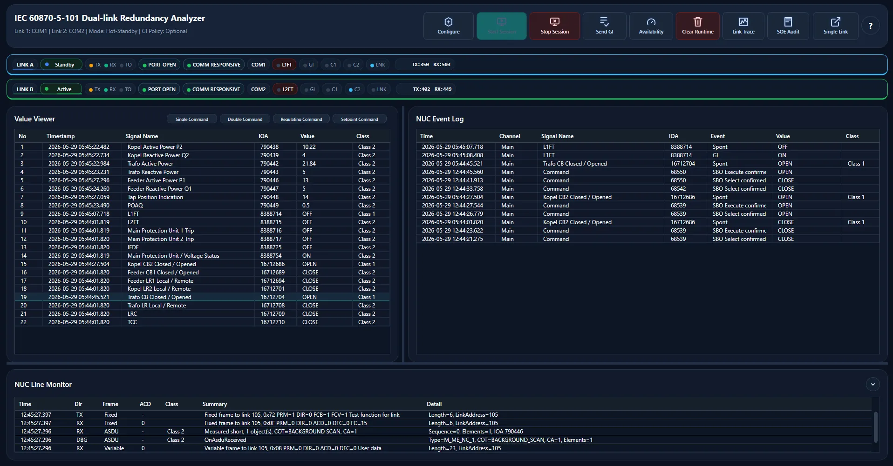
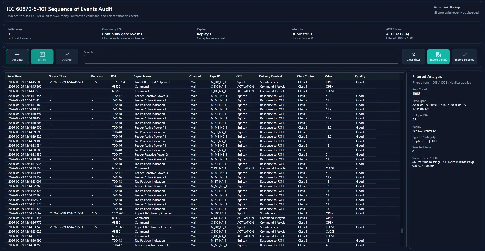
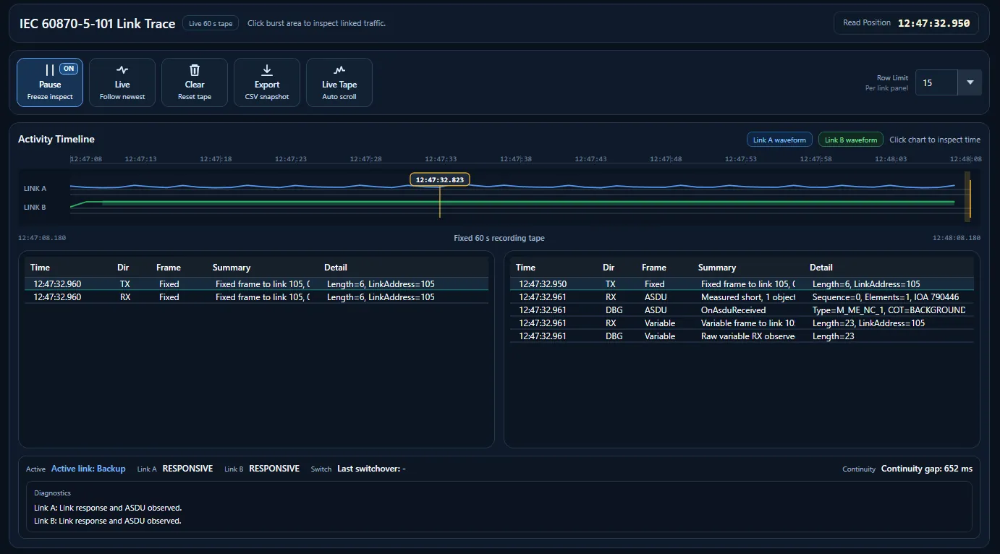
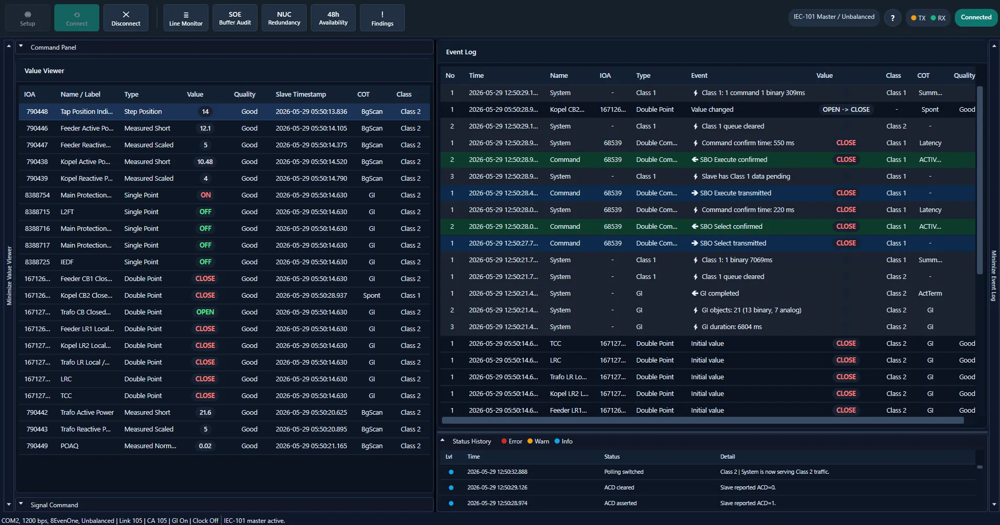
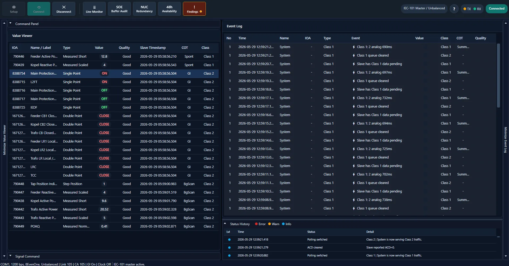
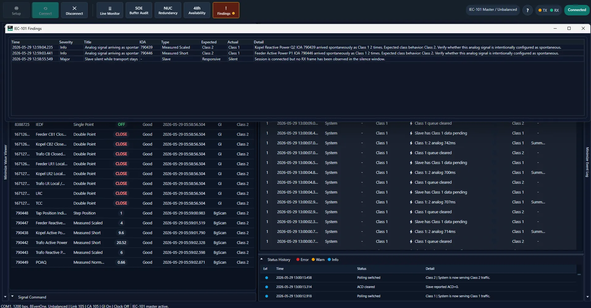

# IEC101 Master Tester

Windows WPF `.NET Framework 4.8` IEC-60870-5-101 master tester and analyzer for SCADA FAT, gateway troubleshooting, NUC redundancy observation, SOE replay audit, and protocol evidence capture.

[](#build)
[](#build)
[](#what-it-does)
[](#native-stack-migration)

[Landing page](https://masarray.github.io/IEC101MasterTester/) | [Roadmap](ROADMAP.md) | [Codex handoff](CODEX_HANDOFF.md)



## Current Status

This project is moving toward a clean-room native C# IEC-101 stack, but the production baseline still keeps `lib60870.NET` as the known-good engine until the migration gates pass.

- `Lib60870` remains the default production communication engine.
- `NativeExperimental` is available as an explicit opt-in engine.
- Native FT1.2 frame parsing, ASDU parsing/encoding, mapper integration, and bounded protocol evidence capture are in place.
- Demo/trial/license restrictions have been removed.
- The project is not Apache-2-ready until `Vendor/lib60870` and incompatible dependency paths are fully removed.

## What It Does

- IEC-101 serial master workflow for practical FAT and troubleshooting.
- Operator value viewer, event journal, status history, findings, availability telemetry, and command lifecycle tracking.
- Line Monitor with factual frame, COT, ACD, DFC, CASDU, IOA, and raw evidence visibility.
- NUC redundancy observation with link activity, switchover, continuity, and GI observation context.
- SOE/buffer replay audit with duplicate/FIFO/minimum-capacity checks.
- Protocol evidence ring buffer for golden trace and native-stack validation work.
- Lightweight UI snapshot buffering so long sessions do not retain large raw payload strings in WPF grids.

## Screenshots

| Mission Control | NUC Redundancy |
| --- | --- |
|  |  |

| Line Monitor | SOE Buffer Audit |
| --- | --- |
|  |  |

| Availability | Findings |
| --- | --- |
|  |  |

## PLN-Oriented Defaults

The default IEC-101 profile follows the working PLN/Pusertif-style baseline used in this repository:

- `1200 bps`
- `8E1`
- link address length `2`
- CASDU length `2`
- IOA length `3`
- originator address `0`
- link address `105`
- CASDU `105`

## Native Stack Migration

The native stack is being developed as clean-room project-owned code under:

- `Services/Iec101/Native`
- `Services/Diagnostics/ProtocolEvidenceRecorder.cs`
- `Services/Diagnostics/ProtocolEvidenceExportService.cs`

Migration rule: do not remove `lib60870.NET` until native mode passes golden trace tests, simulator tests, MSBuild verification, and real RTU/field validation.

Current migration foundation:

- Passive FT1.2 frame decoder and encoder.
- Internal ASDU model and ASDU codec.
- Native mapper path for value rows.
- `NativeExperimental` unbalanced master skeleton.
- Bounded protocol evidence recorder for side-by-side validation.

## Repository Guide

- `AGENTS.md` - contributor and Codex rules.
- `ROADMAP.md` - native-stack and product roadmap.
- `CODEX_HANDOFF.md` - latest cross-laptop continuation context.
- `USER_MANUAL.md` - operator notes.
- `PROJECT_STRUCTURE.md` - source map.
- `docs/` - GitHub Pages landing page.

## Build

Use MSBuild:

```powershell
& 'C:\Program Files\Microsoft Visual Studio\18\Community\MSBuild\Current\Bin\MSBuild.exe' IEC101MasterTester.csproj /t:Build /p:Configuration=Debug /p:UseSharedCompilation=false
```

## License Direction

The intended direction is Apache-2 after vendor code is removed and dependencies/assets are audited. Until then, treat the repository as migration-in-progress and do not assume the final open-source license posture is complete.
